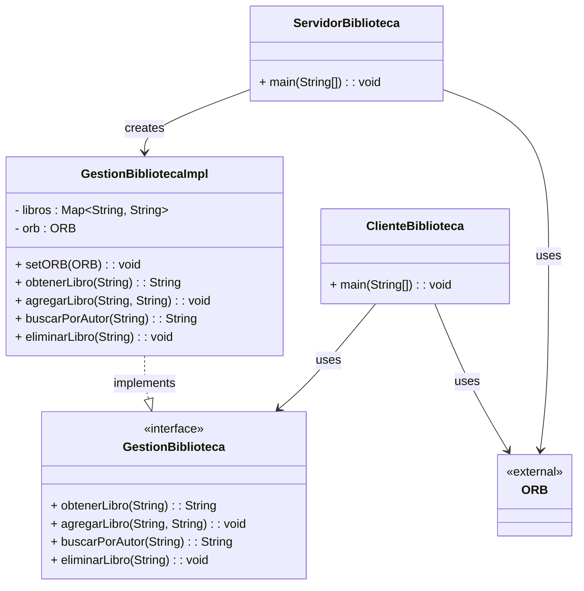

# Distribuidos3

Este proyecto implementa una aplicación cliente-servidor usando CORBA (Common Object Request Broker Architecture) para gestionar una biblioteca distribuida. Permite al cliente conectarse remotamente al servidor para realizar operaciones sobre libros.

## Requisitos

- Java Development Kit (JDK) versión 8 (ej.: OpenJDK, Oracle JDK, Amazon Corretto)
- ORB compatible con CORBA (el incluido en JDK es suficiente)
- Editor: IntelliJ IDEA / Eclipse

## Compilación y ejecución

### 1️. Generar las clases CORBA

Desde la carpeta donde se encuentra `Biblioteca.idl`:

```bash
idlj -fall Biblioteca.idl
```

### 2️. Compilar el servidor y cliente

```bash
javac ServidorBiblioteca.java
javac ClienteBiblioteca.java
```

### 3️. Ejecutar la aplicación

Abrir tres terminales:

**a. Naming Service**

```bash
tnameserv -ORBInitialPort 1050
```

**b. Servidor**

```bash
java ServidorBiblioteca -ORBInitialHost localhost -ORBInitialPort 1050
```

**c. Cliente**

```bash
java ClienteBiblioteca -ORBInitialHost localhost -ORBInitialPort 1050
```

## Funcionalidades implementadas

El cliente puede realizar las siguientes operaciones:

- **agregarLibro(titulo, autor)** → Añadir un nuevo libro a la biblioteca
- **obtenerLibro(titulo)** → Consultar el autor de un libro por su título
- **buscarPorAutor(autor)** → (Ampliación) Obtener todos los libros de un autor concreto
- **eliminarLibro(titulo)** → (Ampliación) Eliminar un libro de la biblioteca

## Diagrama del sistema

## 📋 Diagrama UML




## Notas

- Si el puerto 1050 está en uso, puedes cambiarlo a otro disponible (ej.: 1055).
- La comunicación entre cliente y servidor se realiza mediante llamadas remotas utilizando CORBA.

## Autores

-Raúl Cid González
-Lara González Abad

Grado en Ingeniería Informática  
Universidad Nebrija


